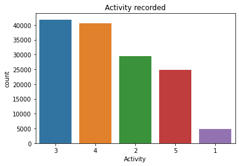
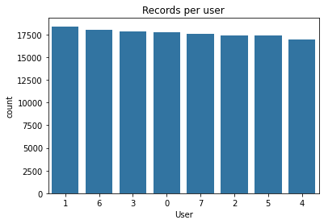
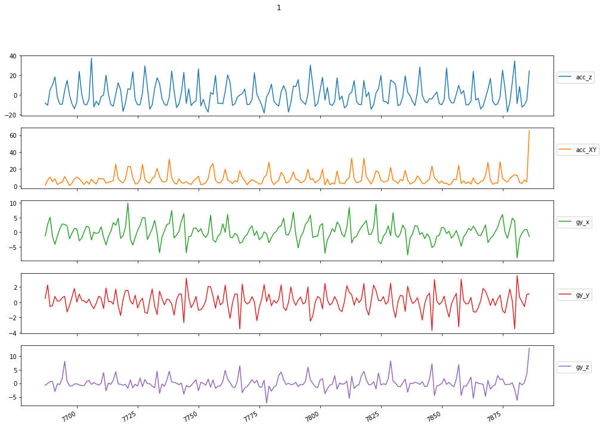
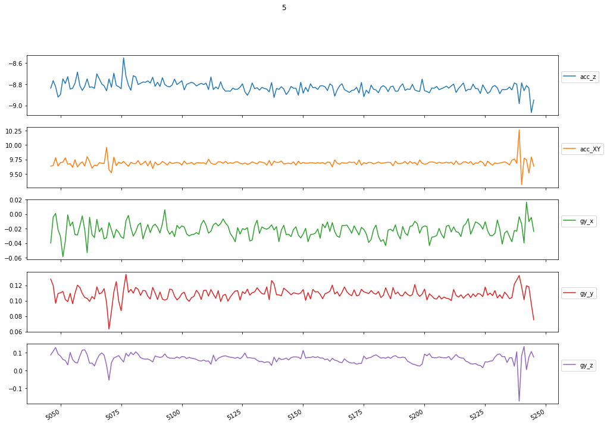
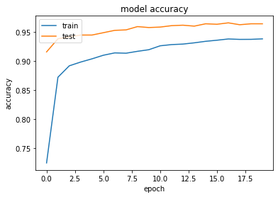
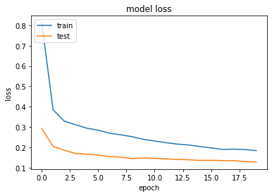

# Human Activity Recognition
---

The aim of this project was labelling different human activities upon the data register by 5 dimensional signals a 2-axes accelerometer and a 3-axes gyroscope. 

The set of activities recorded for labelling were:
* running
* walking
* standing
* sitting
* lying

The data provided for this assignment corresponded to 10 different people, 8 of them labelled and 2 of them unlabelled. Each of the recordings lasted less than 20 minutes.


```python
import numpy as np
import time
import matplotlib.pyplot as plt
import os
from google.colab import drive
from scipy.io import loadmat, savemat
import seaborn as sns
import pandas as pd
from scipy import stats
from sklearn.preprocessing import RobustScaler, OneHotEncoder
from keras.preprocessing import sequence
import tensorflow as tf
import keras
from sklearn.metrics import confusion_matrix
%matplotlib inline
```


# Part 1. Load the dataset.


The labelled data was transferred into a pandas dataframe, which resulted into a matrix of 141,426 rows and 8 columns. Each row corresponded to a measurement performed every  0.0625s, as the recording frequency was 16 Hz. On the other hand, the first five columns corresponded to the sensors that recorded the movements and the remaining three accounted for the user number, the labelled activity and the timestamp. 


```python
# Mount the drive folder
drive.mount('/content/drive')
os.chdir('/content/drive/My Drive/Colab Notebooks/DASS/Assignment 2')

# Open the file and read in data
data = loadmat('HAR_database.mat')
```

    Drive already mounted at /content/drive; to attempt to forcibly remount, call drive.mount("/content/drive", force_remount=True).
    


```python
# Retrieve basic information about the raw dataset
n_people = len(data['database_training'])
n_sensors = len(data['database_training'][0][0])
len_seq = [len(data['database_training'][i][0][0]) for i in range(n_people)]

print("Information about the dataset")
print("==========================")
print('n_people: %i \nn_sensors: %i '%(n_people, n_sensors))

print("\nSequence information")
print("==========================")
pd.Series(len_seq).describe()
```

    Information about the dataset
    ==========================
    n_people: 8 
    n_sensors: 5 
    
    Sequence information
    ==========================
    


    count        8.000000
    mean     17678.250000
    std        447.895635
    min      16920.000000
    25%      17436.750000
    50%      17673.000000
    75%      17883.500000
    max      18411.000000
    dtype: float64


```python
# Transform the data into a nice formatted dataset
for i in range(n_people):
  if i==0:
    df = pd.DataFrame(data['database_training'][i][0].transpose(), columns=['acc_z', 'acc_XY', 'gy_x',
                                                                            'gy_y', 'gy_z'])
    df['User']=len(data['database_training'][i][1][0])*[0]
    df['Activity']=data['database_training'][i][1][0]
    df['Timestamp']=range(len(data['database_training'][i][1][0]))
  else:
    df2 = pd.DataFrame(data['database_training'][i][0].transpose(), columns=['acc_z', 'acc_XY', 'gy_x','gy_y', 'gy_z'])
    df2['User']=len(data['database_training'][i][1][0])*[i]
    df2['Activity']=data['database_training'][i][1][0]
    df2['Timestamp']=range(len(data['database_training'][i][1][0]))
    df = df.append(df2, ignore_index=True)
```


```python
df
```


<div>
<style scoped>
    .dataframe tbody tr th:only-of-type {
        vertical-align: middle;
    }

    .dataframe tbody tr th {
        vertical-align: top;
    }

    .dataframe thead th {
        text-align: right;
    }
</style>
<table border="1" class="dataframe">
  <thead>
    <tr style="text-align: right;">
      <th></th>
      <th>acc_z</th>
      <th>acc_XY</th>
      <th>gy_x</th>
      <th>gy_y</th>
      <th>gy_z</th>
      <th>User</th>
      <th>Activity</th>
      <th>Timestamp</th>
    </tr>
  </thead>
  <tbody>
    <tr>
      <th>0</th>
      <td>0.024173</td>
      <td>0.594417</td>
      <td>-0.022736</td>
      <td>0.111962</td>
      <td>0.060499</td>
      <td>0</td>
      <td>3</td>
      <td>0</td>
    </tr>
    <tr>
      <th>1</th>
      <td>0.019905</td>
      <td>0.602472</td>
      <td>-0.012875</td>
      <td>0.103796</td>
      <td>0.055157</td>
      <td>0</td>
      <td>3</td>
      <td>1</td>
    </tr>
    <tr>
      <th>2</th>
      <td>0.034749</td>
      <td>0.525821</td>
      <td>-0.020016</td>
      <td>0.103193</td>
      <td>0.057541</td>
      <td>0</td>
      <td>3</td>
      <td>2</td>
    </tr>
    <tr>
      <th>3</th>
      <td>0.059832</td>
      <td>0.621057</td>
      <td>-0.026841</td>
      <td>0.104378</td>
      <td>0.063853</td>
      <td>0</td>
      <td>3</td>
      <td>3</td>
    </tr>
    <tr>
      <th>4</th>
      <td>0.044743</td>
      <td>0.653001</td>
      <td>-0.014540</td>
      <td>0.103560</td>
      <td>0.066084</td>
      <td>0</td>
      <td>3</td>
      <td>4</td>
    </tr>
    <tr>
      <th>...</th>
      <td>...</td>
      <td>...</td>
      <td>...</td>
      <td>...</td>
      <td>...</td>
      <td>...</td>
      <td>...</td>
      <td>...</td>
    </tr>
    <tr>
      <th>141421</th>
      <td>0.577717</td>
      <td>1.784139</td>
      <td>-0.081926</td>
      <td>-0.095167</td>
      <td>0.068769</td>
      <td>7</td>
      <td>3</td>
      <td>17605</td>
    </tr>
    <tr>
      <th>141422</th>
      <td>0.577288</td>
      <td>1.860482</td>
      <td>-0.080316</td>
      <td>-0.088788</td>
      <td>0.071567</td>
      <td>7</td>
      <td>3</td>
      <td>17606</td>
    </tr>
    <tr>
      <th>141423</th>
      <td>0.583964</td>
      <td>1.844136</td>
      <td>-0.073664</td>
      <td>-0.101740</td>
      <td>0.081287</td>
      <td>7</td>
      <td>3</td>
      <td>17607</td>
    </tr>
    <tr>
      <th>141424</th>
      <td>0.572480</td>
      <td>1.783769</td>
      <td>-0.073399</td>
      <td>-0.089936</td>
      <td>0.052906</td>
      <td>7</td>
      <td>3</td>
      <td>17608</td>
    </tr>
    <tr>
      <th>141425</th>
      <td>0.582015</td>
      <td>1.817274</td>
      <td>-0.088948</td>
      <td>-0.091812</td>
      <td>0.066497</td>
      <td>7</td>
      <td>3</td>
      <td>17609</td>
    </tr>
  </tbody>
</table>
<p>141426 rows × 8 columns</p>
</div>


```python
# Plot the distribution of the labelled activities
sns.countplot(x = 'Activity',
              data = df,
              order = df.Activity.value_counts().index);

plt.title("Activity recorded");

```


    

    


```python
# Plot the number of records per user
sns.countplot(x = 'User',
              data = df,
              palette=[sns.color_palette()[0]],
              order = df.User.value_counts().index);
plt.title("Records per user");

```


    

    


```python
# Function to plot the 5 sensor recordings given certain activity
def plot_activity(activity, df):
    data = df[df['Activity'] == activity][['acc_z', 'acc_XY', 'gy_x','gy_y', 'gy_z']][:200]
    axis = data.plot(subplots=True, figsize=(16, 12), 
                     title=activity)
    for ax in axis:
        ax.legend(loc='lower left', bbox_to_anchor=(1.0, 0.5))
```


```python
plot_activity(1, df);

```


    

    


```python
plot_activity(3, df);

```


    

    


```python
plot_activity(5, df);

```


    

    


# Part 2. Pre-processing.

This section consists on four procedurals used to clear out the data and to set it ready for fitting it to the model. Those are:
* Splitting the data into train and test sets.
* Scaling the sensor data.
* Creating sequences.
* One-hot encoding the categorical variables.


```python
# Split the dataset into train and test sets
df_train = df_train = df[df['User'] <= 6]
df_test = df[df['User'] > 6]
```

Data recorded by the sensors was scaled using a scaler robust to statistical outliers. The motivation to scale the data is to avoid features with larger values to impact the algorithm with a higher weight although its relevance is similar to features with smaller values.


```python
#Scale the sensor data
scale_columns = ['acc_z', 'acc_XY', 'gy_x','gy_y', 'gy_z']

scaler = RobustScaler()

scaler = scaler.fit(df_train[scale_columns])

df_train.loc[:, scale_columns] = scaler.transform(
  df_train[scale_columns].to_numpy()
)

df_test.loc[:, scale_columns] = scaler.transform(
  df_test[scale_columns].to_numpy()
)
```

    /usr/local/lib/python3.6/dist-packages/pandas/core/indexing.py:966: SettingWithCopyWarning: 
    A value is trying to be set on a copy of a slice from a DataFrame.
    Try using .loc[row_indexer,col_indexer] = value instead
    
    See the caveats in the documentation: https://pandas.pydata.org/pandas-docs/stable/user_guide/indexing.html#returning-a-view-versus-a-copy
      self.obj[item] = s
    /usr/local/lib/python3.6/dist-packages/pandas/core/indexing.py:966: SettingWithCopyWarning: 
    A value is trying to be set on a copy of a slice from a DataFrame.
    Try using .loc[row_indexer,col_indexer] = value instead
    
    See the caveats in the documentation: https://pandas.pydata.org/pandas-docs/stable/user_guide/indexing.html#returning-a-view-versus-a-copy
      self.obj[item] = s
    


```python
# Function to create sequences
def create_dataset(X, y, time_steps=1, step=1):
    Xs, ys = [], []
    for i in range(0, len(X) - time_steps, step):
        v = X.iloc[i:(i + time_steps)].values
        labels = y.iloc[i: i + time_steps]
        Xs.append(v)
        ys.append(stats.mode(labels)[0][0])
    return np.array(Xs), np.array(ys).reshape(-1, 1)
```

Sequences were created so the model was able to handle the data more easily. Thus, the raw data was summarized into sequences of 1 timestep, were each step was worth 10 measurements. The labelling for every step was created upon the mode of the previous mentioned measurements. The remaining sequences had the shape (12382, 1, 5), which can be understood as a total of 12,382 sequences, each 1 timestep long, containing the 5 sensor measurements with its corresponding label.


```python
# Create sequences from the train and test datasets
TIME_STEPS = 1
STEP = 10

X_train, y_train = create_dataset(
    df_train[['acc_z', 'acc_XY', 'gy_x','gy_y', 'gy_z']],
    df_train.Activity,
    TIME_STEPS,
    STEP
)

X_test, y_test = create_dataset(
    df_test[['acc_z', 'acc_XY', 'gy_x','gy_y', 'gy_z']],
    df_test.Activity,
    TIME_STEPS,
    STEP
)
```


```python
print(X_train.shape, y_train.shape)
```

    (12382, 1, 5) (12382, 1)
    


```python
# One-hot encode the labelled activities
enc = OneHotEncoder(handle_unknown='ignore', sparse=False)

enc = enc.fit(y_train)

y_train = enc.transform(y_train)
y_test = enc.transform(y_test)
```

# Part 3. Create and fit the model.

Long Short Term Memory is an algorithm used on the deep learning field to classify time series data, as the one used on this assignment. The difficulty of this problem relies on the length of the sequences and variety of possible inputs the model can receive over time. Therefore, it is necessary for the model to learn the long-term dependencies between the coordinates given by the input sequence.

The main difference between regular neural networks and this model is that it has feedback connections, allowing it to remember what has been previously learnt. That is, maintaining state memory across long sequences. Instead of regular neurons, LSTM networks include a memory cells which let them learn long-term dependencies. These cells are formed by a set of gates that control when information is output, input and forgotten.


Moreover, this procedure simplified the feature extraction, dimensionality reduction and classification steps into a single command. Just by training the neural network, the model will have retrieved the features, learnt what makes the difference and classified the input upon this knowledge.

The model used for classifying the sequences was a bidirectional LSTM, accompanied by a dropout layer (which helps avoiding overfitting) and two activation layers (which introduce non linearity to the output). The model was fitted to 20 epochs, each trained to 11,143 samples and validated onto 1,239 other ones. 


```python
# Create the LSTM model with keras
model = keras.Sequential()
model.add(
    keras.layers.Bidirectional(
      keras.layers.LSTM(
          units=128,
          input_shape=[X_train.shape[1], X_train.shape[2]]
      )
    )
)
model.add(keras.layers.Dropout(rate=0.5))
model.add(keras.layers.Dense(units=128, activation='relu'))
model.add(keras.layers.Dense(y_train.shape[1], activation='softmax'))

model.compile(
  loss='categorical_crossentropy',
  optimizer='adam',
  metrics=['acc']
)

```


```python
# Fit the data to the model
history = model.fit(
    X_train, y_train,
    epochs=20,
    batch_size=32,
    validation_split=0.1,
    shuffle=False
)
```

    Train on 11143 samples, validate on 1239 samples
    Epoch 1/20
    11143/11143 [==============================] - 3s 232us/step - loss: 0.8127 - acc: 0.7249 - val_loss: 0.2921 - val_acc: 0.9161
    Epoch 2/20
    11143/11143 [==============================] - 2s 157us/step - loss: 0.3851 - acc: 0.8725 - val_loss: 0.2058 - val_acc: 0.9387
    Epoch 3/20
    11143/11143 [==============================] - 2s 164us/step - loss: 0.3290 - acc: 0.8921 - val_loss: 0.1859 - val_acc: 0.9419
    Epoch 4/20
    11143/11143 [==============================] - 2s 168us/step - loss: 0.3111 - acc: 0.8986 - val_loss: 0.1702 - val_acc: 0.9451
    Epoch 5/20
    11143/11143 [==============================] - 2s 177us/step - loss: 0.2942 - acc: 0.9042 - val_loss: 0.1666 - val_acc: 0.9451
    Epoch 6/20
    11143/11143 [==============================] - 2s 171us/step - loss: 0.2845 - acc: 0.9103 - val_loss: 0.1624 - val_acc: 0.9492
    Epoch 7/20
    11143/11143 [==============================] - 2s 169us/step - loss: 0.2696 - acc: 0.9144 - val_loss: 0.1547 - val_acc: 0.9532
    Epoch 8/20
    11143/11143 [==============================] - 2s 169us/step - loss: 0.2618 - acc: 0.9138 - val_loss: 0.1523 - val_acc: 0.9540
    Epoch 9/20
    11143/11143 [==============================] - 2s 172us/step - loss: 0.2526 - acc: 0.9171 - val_loss: 0.1444 - val_acc: 0.9596
    Epoch 10/20
    11143/11143 [==============================] - 2s 176us/step - loss: 0.2397 - acc: 0.9199 - val_loss: 0.1481 - val_acc: 0.9580
    Epoch 11/20
    11143/11143 [==============================] - 2s 178us/step - loss: 0.2315 - acc: 0.9266 - val_loss: 0.1461 - val_acc: 0.9588
    Epoch 12/20
    11143/11143 [==============================] - 2s 175us/step - loss: 0.2230 - acc: 0.9287 - val_loss: 0.1437 - val_acc: 0.9613
    Epoch 13/20
    11143/11143 [==============================] - 2s 168us/step - loss: 0.2162 - acc: 0.9296 - val_loss: 0.1407 - val_acc: 0.9621
    Epoch 14/20
    11143/11143 [==============================] - 2s 168us/step - loss: 0.2119 - acc: 0.9317 - val_loss: 0.1393 - val_acc: 0.9605
    Epoch 15/20
    11143/11143 [==============================] - 2s 170us/step - loss: 0.2043 - acc: 0.9343 - val_loss: 0.1362 - val_acc: 0.9645
    Epoch 16/20
    11143/11143 [==============================] - 2s 173us/step - loss: 0.1976 - acc: 0.9362 - val_loss: 0.1366 - val_acc: 0.9637
    Epoch 17/20
    11143/11143 [==============================] - 2s 174us/step - loss: 0.1900 - acc: 0.9383 - val_loss: 0.1351 - val_acc: 0.9661
    Epoch 18/20
    11143/11143 [==============================] - 2s 170us/step - loss: 0.1912 - acc: 0.9376 - val_loss: 0.1346 - val_acc: 0.9629
    Epoch 19/20
    11143/11143 [==============================] - 2s 180us/step - loss: 0.1893 - acc: 0.9377 - val_loss: 0.1306 - val_acc: 0.9645
    Epoch 20/20
    11143/11143 [==============================] - 2s 186us/step - loss: 0.1840 - acc: 0.9385 - val_loss: 0.1277 - val_acc: 0.9645
    

# Part 4. Evaluate the model.

The aim of this section was to evaluate the model in terms of overfitting and accuracy.The model showed no relevant overfitting and an accuracy of 83.1%. 

Moreover, there was created a confusion matrix in order to asses the labelling of each of the classes. It showed the most misclassified class was sitting (note the index of the classes should sum one to match the integer classes).


```python
# summarize history for accuracy
plt.plot(history.history['acc'])
plt.plot(history.history['val_acc'])
plt.title('model accuracy')
plt.ylabel('accuracy')
plt.xlabel('epoch')
plt.legend(['train', 'test'], loc='upper left')
plt.show()
# summarize history for loss
plt.plot(history.history['loss'])
plt.plot(history.history['val_loss'])
plt.title('model loss')
plt.ylabel('loss')
plt.xlabel('epoch')
plt.legend(['train', 'test'], loc='upper left')
plt.show()
```


    

    


    

    


```python
# Evaluate the accuracy on the test set
model.evaluate(x=X_test,y=y_test)
```

    1761/1761 [==============================] - 0s 40us/step
    


    [0.6171328042470414, 0.8319137096405029]


```python
# Create confusion matrix
y_pred = model.predict(X_test)
y_test = y_test.argmax(1)
y_pred= y_pred.argmax(1)

import seaborn as sns
conf = confusion_matrix(y_test, y_pred)
cm = sns.light_palette("blue", as_cmap=True)
x=pd.DataFrame(conf)
x=x.style.background_gradient(cmap=cm)
display(x)
```


<style  type="text/css" >
    #T_13d901f0_a96d_11ea_a031_0242ac1c0002row0_col0 {
            background-color:  #0000ff;
            color:  #f1f1f1;
        }    #T_13d901f0_a96d_11ea_a031_0242ac1c0002row0_col1 {
            background-color:  #d2d2ff;
            color:  #000000;
        }    #T_13d901f0_a96d_11ea_a031_0242ac1c0002row0_col2 {
            background-color:  #e5e5ff;
            color:  #000000;
        }    #T_13d901f0_a96d_11ea_a031_0242ac1c0002row0_col3 {
            background-color:  #e5e5ff;
            color:  #000000;
        }    #T_13d901f0_a96d_11ea_a031_0242ac1c0002row0_col4 {
            background-color:  #e3e3ff;
            color:  #000000;
        }    #T_13d901f0_a96d_11ea_a031_0242ac1c0002row1_col0 {
            background-color:  #9595ff;
            color:  #000000;
        }    #T_13d901f0_a96d_11ea_a031_0242ac1c0002row1_col1 {
            background-color:  #0000ff;
            color:  #f1f1f1;
        }    #T_13d901f0_a96d_11ea_a031_0242ac1c0002row1_col2 {
            background-color:  #dfdfff;
            color:  #000000;
        }    #T_13d901f0_a96d_11ea_a031_0242ac1c0002row1_col3 {
            background-color:  #e3e3ff;
            color:  #000000;
        }    #T_13d901f0_a96d_11ea_a031_0242ac1c0002row1_col4 {
            background-color:  #e5e5ff;
            color:  #000000;
        }    #T_13d901f0_a96d_11ea_a031_0242ac1c0002row2_col0 {
            background-color:  #e5e5ff;
            color:  #000000;
        }    #T_13d901f0_a96d_11ea_a031_0242ac1c0002row2_col1 {
            background-color:  #e5e5ff;
            color:  #000000;
        }    #T_13d901f0_a96d_11ea_a031_0242ac1c0002row2_col2 {
            background-color:  #0000ff;
            color:  #f1f1f1;
        }    #T_13d901f0_a96d_11ea_a031_0242ac1c0002row2_col3 {
            background-color:  #e5e5ff;
            color:  #000000;
        }    #T_13d901f0_a96d_11ea_a031_0242ac1c0002row2_col4 {
            background-color:  #e5e5ff;
            color:  #000000;
        }    #T_13d901f0_a96d_11ea_a031_0242ac1c0002row3_col0 {
            background-color:  #e5e5ff;
            color:  #000000;
        }    #T_13d901f0_a96d_11ea_a031_0242ac1c0002row3_col1 {
            background-color:  #e5e5ff;
            color:  #000000;
        }    #T_13d901f0_a96d_11ea_a031_0242ac1c0002row3_col2 {
            background-color:  #e5e5ff;
            color:  #000000;
        }    #T_13d901f0_a96d_11ea_a031_0242ac1c0002row3_col3 {
            background-color:  #0000ff;
            color:  #f1f1f1;
        }    #T_13d901f0_a96d_11ea_a031_0242ac1c0002row3_col4 {
            background-color:  #e5e5ff;
            color:  #000000;
        }    #T_13d901f0_a96d_11ea_a031_0242ac1c0002row4_col0 {
            background-color:  #e5e5ff;
            color:  #000000;
        }    #T_13d901f0_a96d_11ea_a031_0242ac1c0002row4_col1 {
            background-color:  #e5e5ff;
            color:  #000000;
        }    #T_13d901f0_a96d_11ea_a031_0242ac1c0002row4_col2 {
            background-color:  #e5e5ff;
            color:  #000000;
        }    #T_13d901f0_a96d_11ea_a031_0242ac1c0002row4_col3 {
            background-color:  #8787ff;
            color:  #000000;
        }    #T_13d901f0_a96d_11ea_a031_0242ac1c0002row4_col4 {
            background-color:  #0000ff;
            color:  #f1f1f1;
        }</style><table id="T_13d901f0_a96d_11ea_a031_0242ac1c0002" ><thead>    <tr>        <th class="blank level0" ></th>        <th class="col_heading level0 col0" >0</th>        <th class="col_heading level0 col1" >1</th>        <th class="col_heading level0 col2" >2</th>        <th class="col_heading level0 col3" >3</th>        <th class="col_heading level0 col4" >4</th>    </tr></thead><tbody>
                <tr>
                        <th id="T_13d901f0_a96d_11ea_a031_0242ac1c0002level0_row0" class="row_heading level0 row0" >0</th>
                        <td id="T_13d901f0_a96d_11ea_a031_0242ac1c0002row0_col0" class="data row0 col0" >23</td>
                        <td id="T_13d901f0_a96d_11ea_a031_0242ac1c0002row0_col1" class="data row0 col1" >25</td>
                        <td id="T_13d901f0_a96d_11ea_a031_0242ac1c0002row0_col2" class="data row0 col2" >2</td>
                        <td id="T_13d901f0_a96d_11ea_a031_0242ac1c0002row0_col3" class="data row0 col3" >0</td>
                        <td id="T_13d901f0_a96d_11ea_a031_0242ac1c0002row0_col4" class="data row0 col4" >1</td>
            </tr>
            <tr>
                        <th id="T_13d901f0_a96d_11ea_a031_0242ac1c0002level0_row1" class="row_heading level0 row1" >1</th>
                        <td id="T_13d901f0_a96d_11ea_a031_0242ac1c0002row1_col0" class="data row1 col0" >8</td>
                        <td id="T_13d901f0_a96d_11ea_a031_0242ac1c0002row1_col1" class="data row1 col1" >282</td>
                        <td id="T_13d901f0_a96d_11ea_a031_0242ac1c0002row1_col2" class="data row1 col2" >14</td>
                        <td id="T_13d901f0_a96d_11ea_a031_0242ac1c0002row1_col3" class="data row1 col3" >7</td>
                        <td id="T_13d901f0_a96d_11ea_a031_0242ac1c0002row1_col4" class="data row1 col4" >0</td>
            </tr>
            <tr>
                        <th id="T_13d901f0_a96d_11ea_a031_0242ac1c0002level0_row2" class="row_heading level0 row2" >2</th>
                        <td id="T_13d901f0_a96d_11ea_a031_0242ac1c0002row2_col0" class="data row2 col0" >0</td>
                        <td id="T_13d901f0_a96d_11ea_a031_0242ac1c0002row2_col1" class="data row2 col1" >1</td>
                        <td id="T_13d901f0_a96d_11ea_a031_0242ac1c0002row2_col2" class="data row2 col2" >502</td>
                        <td id="T_13d901f0_a96d_11ea_a031_0242ac1c0002row2_col3" class="data row2 col3" >0</td>
                        <td id="T_13d901f0_a96d_11ea_a031_0242ac1c0002row2_col4" class="data row2 col4" >0</td>
            </tr>
            <tr>
                        <th id="T_13d901f0_a96d_11ea_a031_0242ac1c0002level0_row3" class="row_heading level0 row3" >3</th>
                        <td id="T_13d901f0_a96d_11ea_a031_0242ac1c0002row3_col0" class="data row3 col0" >0</td>
                        <td id="T_13d901f0_a96d_11ea_a031_0242ac1c0002row3_col1" class="data row3 col1" >1</td>
                        <td id="T_13d901f0_a96d_11ea_a031_0242ac1c0002row3_col2" class="data row3 col2" >0</td>
                        <td id="T_13d901f0_a96d_11ea_a031_0242ac1c0002row3_col3" class="data row3 col3" >575</td>
                        <td id="T_13d901f0_a96d_11ea_a031_0242ac1c0002row3_col4" class="data row3 col4" >0</td>
            </tr>
            <tr>
                        <th id="T_13d901f0_a96d_11ea_a031_0242ac1c0002level0_row4" class="row_heading level0 row4" >4</th>
                        <td id="T_13d901f0_a96d_11ea_a031_0242ac1c0002row4_col0" class="data row4 col0" >0</td>
                        <td id="T_13d901f0_a96d_11ea_a031_0242ac1c0002row4_col1" class="data row4 col1" >0</td>
                        <td id="T_13d901f0_a96d_11ea_a031_0242ac1c0002row4_col2" class="data row4 col2" >0</td>
                        <td id="T_13d901f0_a96d_11ea_a031_0242ac1c0002row4_col3" class="data row4 col3" >237</td>
                        <td id="T_13d901f0_a96d_11ea_a031_0242ac1c0002row4_col4" class="data row4 col4" >83</td>
            </tr>
    </tbody></table>


# Part 5. Predict the unlabelled sequences.

Finally, the unlabelled data was prepocessed as the prior data set and inputed to trained model in order to predict the missing labels. 


```python
# Reformat the unlabelled raw data
n_people = len(data['database_test'])
for i in range(n_people):
  if i==0:
    df_pred = pd.DataFrame(data['database_test'][i][0].transpose(), columns=['acc_z', 'acc_XY', 'gy_x',
                                                                            'gy_y', 'gy_z'])
    df_pred['User']=len(data['database_test'][i][0][0])*[0]
    df_pred['Timestamp']=range(len(data['database_test'][i][0][0]))
    df_pred['Activity']=len(data['database_test'][i][0][0])*[0]
  else:
    df2 = pd.DataFrame(data['database_test'][i][0].transpose(), columns=['acc_z', 'acc_XY', 'gy_x','gy_y', 'gy_z'])
    df2['User']=len(data['database_test'][i][0][0])*[i]
    df2['Timestamp']=range(len(data['database_test'][i][0][0]))
    df2['Activity']=len(data['database_test'][i][0][0])*[0]
```


```python
df_pred.shape
```


    (19573, 8)


```python
df2.shape
```


    (22615, 8)


```python
# Scale the sensor information data

df_pred.loc[:, scale_columns] = scaler.transform(
  df_pred[scale_columns].to_numpy()
)

df2.loc[:, scale_columns] = scaler.transform(
  df2[scale_columns].to_numpy()
)

```


```python
# Create a sequence with the unlabelled dataframe

# Function to create sequences
def create_dataset(X, y, time_steps=1, step=1):
    Xs, ys = [], []
    for i in range(0, len(X)):
        v = X.iloc[i:(i + time_steps)].values
        labels = y.iloc[i: i + time_steps]
        Xs.append(v)
        ys.append(stats.mode(labels)[0][0])
    return np.array(Xs), np.array(ys).reshape(-1, 1)


TIME_STEPS = 1
STEP = 1

X_topred, y_topred = create_dataset(
    df_pred[['acc_z', 'acc_XY', 'gy_x','gy_y', 'gy_z']],
    df_pred.Activity,
    TIME_STEPS,
    STEP
)


X_topred2, y_topred2 = create_dataset(
    df2[['acc_z', 'acc_XY', 'gy_x','gy_y', 'gy_z']],
    df2.Activity,
    TIME_STEPS,
    STEP
)
```


```python
X_topred.shape
```


    (19573, 1, 5)


```python
X_topred2.shape
```


    (22615, 1, 5)


```python
# Predict the features labelling using the model
y_topred = model.predict(X_topred)
y_topred = y_topred.argmax(1)


y_topred2 = model.predict(X_topred2)
y_topred2 = y_topred2.argmax(1)
```


```python
len(y_topred)
```


    19573


```python
len(y_topred2)
```


    22615


```python
y_topred = y_topred + 1
y_topred2 = y_topred2 + 1
```


```python
savemat('predictions2.mat', {'user_1': y_topred, 'user_2': y_topred2})
```
