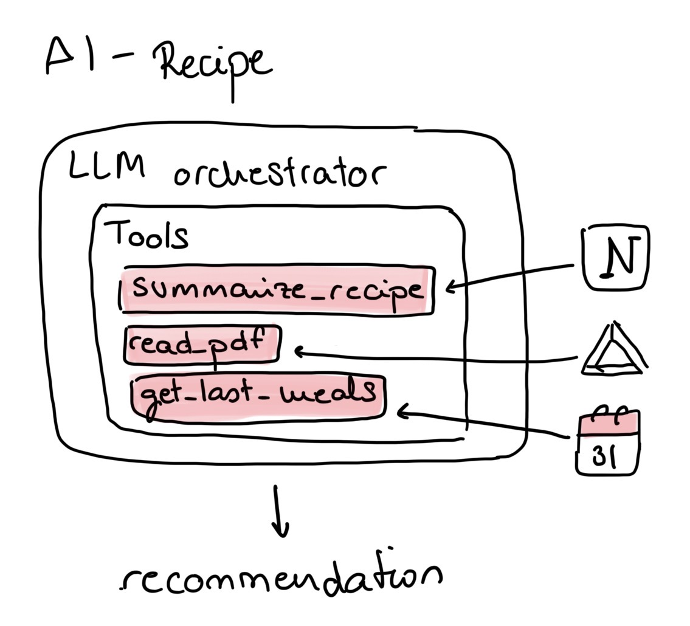
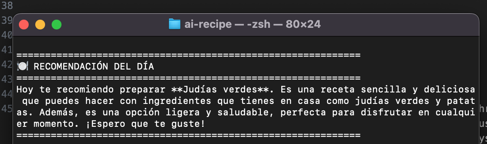

# AI Recipe Agent

Tired of asking ourselves every day *“what should we eat?”*, my husband and I built an AI agent designed to reduce our mental load.

By leveraging information about our usual recipes, the latest groceries we’ve bought, and our recent meals, the agent is able to suggest nutritious and relevant meal options.

---

## Integrations

To make informed decisions, the agent pulls data from three main sources:

- A Google Calendar with the meals we’ve eaten  
- A Drive folder containing PDF receipts from our weekly groceries  
- A Notion database with our family recipes  

The first two sources were connected via APIs. We set them up using Google Cloud Console, which initially felt overwhelming, but with the help of Claude, we managed to get everything running smoothly.

As for the Notion database, it started as a “nerdy” project when we moved in together—but it turned out to be incredibly useful. We connected it to the agent through Notion integrations.

---

## The Tools

We structured the system into three groups of tools, each corresponding to one of the data sources. The goal was to process the raw information and transform it into useful context for the orchestrator.

Some of the tools include:

- An [OCR-based PDF reader](https://github.com/Marinaobdulia/ai-recipe/blob/239eda2e72da44a2b51172d60075289e8b5bfbd4/tools/drive_tools.py#L79) to extract grocery data  
- A [recipe summarizer](https://github.com/Marinaobdulia/ai-recipe/blob/239eda2e72da44a2b51172d60075289e8b5bfbd4/tools/drive_tools.py#L111) powered by an LLM  
- A [calendar integration](https://github.com/Marinaobdulia/ai-recipe/blob/main/tools/calendar_tools.py) to retrieve meals from the past week  

You can check the full code [here](https://github.com/Marinaobdulia/ai-recipe/)

---

## The Agent

LLMs are powerful—but LLMs with the right context are game-changing.

This part of the system is surprisingly simple, yet incredibly effective.

The code behind the tools is not very different from what I’ve been doing throughout my career as a data scientist. However, when combined with an LLM, fulfilling user needs becomes significantly easier and more natural than traditional rule-based systems.

This additional layer of understanding transforms a set of instructions into outputs that feel intuitive and almost human.

As you can probably tell—I’m genuinely amazed by what this enables.

---

## Future Improvements

We’d love to extend this project further:

- Turn the agent into the brain of a Telegram bot  
- Add image processing capabilities (not just PDFs)  

We’ll keep you posted on whether it actually helps reduce our mental load 😉